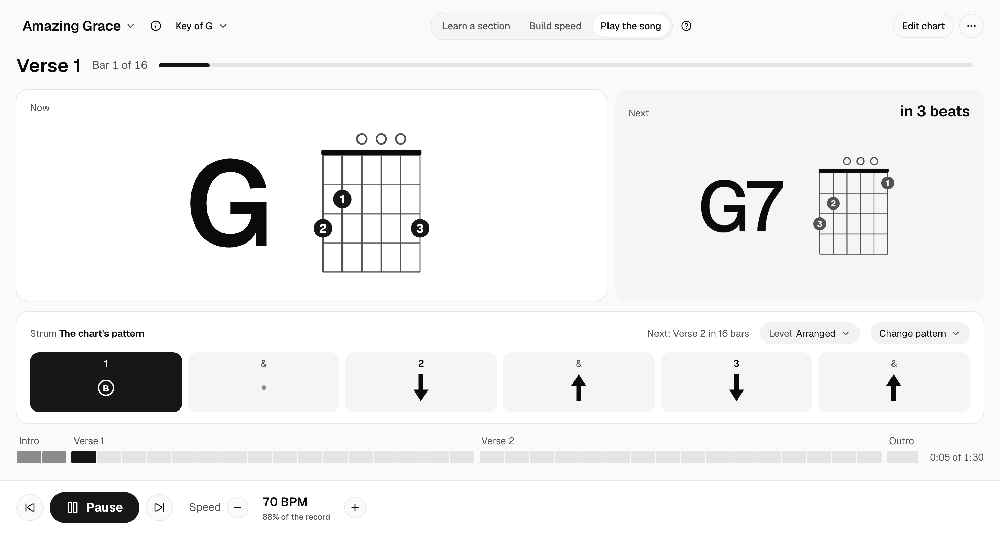

# Song Practice

A guitar practice app for learning songs you can sing along to. It plays your guitar part and a click, shows the chord you're on and the one coming next, and takes each song from easy chords up to the way it's played on the record.



Try it in your browser at <https://brijrajpatil.github.io/LearnGuitar/>. It opens on Amazing Grace and installs as an app from Chrome or Safari.

Status: milestone 1 of 6 is built and in its week of practice ([milestones](docs/product/product-brief.md#milestones)). The app is now a TypeScript web app you can install, rebuilt from a single-file prototype that's kept in [`prototype/`](prototype/).

## Why I'm building it

I'm a self-taught guitarist. YouTube tutorials show the chords and the strum, but you can't play along with them, and for many songs there's no tutorial at all. Ultimate Guitar's play-along mixes several instruments, so I couldn't hear my own part or see where the chords and strums change.

I wanted one screen that plays only my part with a click, slows down when I need it to, and has a simpler version of every part as a step toward the recorded one. I'm the first user. Once it works well for me, I want other guitarists to use it too.

The [product brief](docs/product/product-brief.md) has the full problem, goals, features and plan.

## What it does now

- Asks what you're practising and shows only what that needs. Learn a section loops one part. Build speed loops it and speeds up a little each time through, up to your goal. Play the song plays it start to end.
- Plays a synthesized acoustic guitar part and a click in time, with a one-bar count-in.
- Shows the current and next chord with diagrams, and counts down the beats to the next change.
- A strum strip shows each down, up and missed strum as it plays, and warns a bar before the pattern changes.
- Three levels for every song. Beginner strums one downstroke per beat. Arranged uses each section's own pattern. Record plays the figure from the record where the chart has one.
- Simplify chords swaps hard shapes for easier ones, for example F#m for a four-string version.
- Shows the key the record is in, and plays any song with the chords of another key, so you can stick to one chord family while you learn it. It sets the capo that keeps the record's sound, for example G shapes with a capo on fret 2 for a song in A.
- Speed shows the BPM and how it compares with the record ("88% of the record"), with quick picks from 60% to the record's speed.
- A song map along the bottom: click a bar to jump to it, or a section name to loop it.
- A built-in library of 17 progression studies and 34 public domain folk songs, with chords only. The library page lists each one with its chords and difficulty. Search it by title, artist or chord, and filter it by collection and difficulty.
- Songs are text charts you write in the built-in editor, with errors marked by line. Custom strum and pick patterns can be any length and run on across bar lines.
- Works from the keyboard: Space plays and pauses, the arrow keys change section and speed, L loops the section, / opens the library, and K picks the key and capo. A foot pedal that sends these keys works too.
- A light, monochrome theme. The play screen fits in the window like a desktop app, follows browser zoom, and is laid out for screens from a phone to a large monitor.
- Installs as an app from Chrome or Safari and works offline.

Songs and settings are saved in your browser on this device. Nothing is sent anywhere.

## Run it

You need [Node.js](https://nodejs.org) 22 or later. The app is in the `app/` folder.

```bash
cd app
```

```bash
npm install
```

```bash
npm run dev
```

Then open <http://localhost:8642>. It opens on Amazing Grace, a public domain hymn in 3/4 with easy open chords. The [app's README](app/README.md) lists every command, how to add your own songs and how to bring over the prototype's data.

## Writing a song chart

A chart is plain text. This one has two sections:

```text
title: New song
key: G
time: 4/4
tempo: 90

[Verse 1] pattern=C
G | G | C | C | Em | Em | D | D
[Chorus] pattern=B record=D.DU.UDU
C | G | D | Em*2
```

- `pattern=` picks a preset strum (A to E) or a figure. `record=` is the figure as played on the record, used at the Record level.
- Figures have one character per eighth note: `D` and `U` strum down and up, `.` misses, `1` to `6` pick a string (1 is high E), `B` picks the chord's bass note.
- Bars are separated by `|`. Two chords in a bar split it. `Em*2` repeats a bar.

The full reference is in the app: Edit chart, then Chart format.

The app never fetches lyrics or tabs. Anything like that in a chart is what you typed from your own sources ([why](docs/decisions/0003-lyrics-and-tabs-are-user-entered.md)).

## How it's built

A TypeScript web app built with Vite and React, installable as a PWA. The interface uses [shadcn/ui](https://ui.shadcn.com) on React Aria Components with Tailwind CSS v4 ([decision 0001](docs/decisions/0001-design-system.md)). The look is a light, monochrome theme with the Geist typeface. Its colors, type sizes and spacing come from one token file, and a test checks their contrast. The [design system](docs/design/design-system.md) describes the tokens, the components and the play screen. Songs and settings are stored in IndexedDB.

Data flows one way: song, then timeline, then audio and screen. The music and audio code has no React in it, so it can be tested on its own. The [app's README](app/README.md#code-map) maps the code, and the [product brief's architecture section](docs/product/product-brief.md#architecture) has the reasoning.

## Where it's going

1. Foundation: rebuild the prototype as a TypeScript PWA, with tests. Built, now in its week of practice.
2. A song library, capo and lyrics with tap to sync.
3. Levels per part, marking passes clean, and a practice log.
4. Rhythm technique: chord change drill, gap click, sixteenth notes and triplets.
5. Lead parts: riffs and solos in tab, with a mixer.
6. Tablet support and recording yourself.

Each milestone ends with a week of real practice and a written review before the next one starts.

## What's in this repo

| Path | What it holds |
|---|---|
| [`app/`](app/) | The web app: code, tests and build setup |
| [`docs/`](docs/) | The product brief, the design system, decision notes and milestone reviews. The [docs guide](docs/README.md) says what to read first |
| [`prototype/`](prototype/) | The single-file prototype the app was rebuilt from |
| [`.github/workflows/`](.github/workflows/) | The workflow that tests every pull request and publishes `main` to GitHub Pages |
| [`CHANGELOG.md`](CHANGELOG.md) | What changed in the app |
| [`CLAUDE.md`](CLAUDE.md) | Working notes for Claude Code, the AI coding assistant used on this project |

## License

No license yet, so the code is all rights reserved. You're welcome to read it and try the app. Reusing the code needs my permission.
