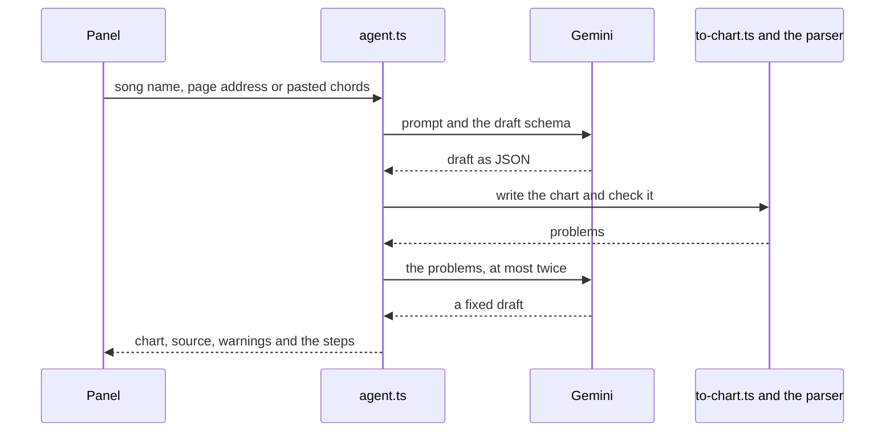

# Song Practice: the app

The web app's code, tests and build setup. What the app is and why it exists is in the [main README](../README.md).

A TypeScript web app built with Vite and React, installable as a PWA. The interface uses [shadcn/ui](https://ui.shadcn.com) on React Aria Components with Tailwind CSS v4. Songs and settings are stored in IndexedDB.

## Run it

You need [Node.js](https://nodejs.org) 22 or later. Run every command from this folder.

```bash
npm install
```

```bash
npm run dev
```

Then open <http://localhost:8642>. It opens on Amazing Grace, a public domain hymn in 3/4 with easy open chords.

| Command | What it does |
|---|---|
| `npm run dev` | Runs the app with live reload |
| `npm run build` | Type-checks and builds the installable app into `dist/` |
| `npm run preview` | Serves the built app, offline support included |
| `npm test` | Unit tests for the chart format, theory, timeline, transport, storage, the song library, adding songs with AI, the loop and speed-up, lyrics and tap to sync, and theme contrast |
| `npm run test:e2e` | Browser tests in Chrome: the main flows, layout at zoom levels from 100% to 400%, and a 20-second timing check |
| `npm run test:timing` | The full two-minute timing check |
| `npm run lint` | ESLint |
| `npm run typecheck` | TypeScript, without building |

In the browser console, `window.__practice.sync()` reports timing stats for the audio scheduler.

## Deploying

The live app is at <https://brijrajpatil.github.io/LearnGuitar/>, on GitHub Pages ([decision 0013](../docs/decisions/0013-github-pages-hosting.md)).

The workflow in [`../.github/workflows/deploy.yml`](../.github/workflows/deploy.yml) runs on every pull request and every push to `main`. It runs lint, typecheck, the unit tests, the browser tests and the build. The timing test is left out, because shared CI machines are too uneven for it, so run it here before merging audio changes. Pushes to `main` then publish `dist/` to Pages, so anything merged goes live.

The live app keeps its own songs and settings, apart from what you saved at `localhost:8642`. Personal songs from `songs/` load only on localhost.

## Your own songs

To keep your own charts out of git, put them in `songs/personal.js` at the repo root, one level up from this folder. The `songs/` folder is git-ignored. The local dev and preview servers serve it, and a deployed build never includes it:

```js
window.PERSONAL_SONGS = [
  { id: 'my-song', chart: `title: My song
tempo: 90

[Verse 1] pattern=C
G | C | Em | D` },
];
```

Keep each `id` the same once you've used a song. The app saves your edits and tempos under it.

## Library songs

The songs built into the app are in `src/data/library/`. Each one is a chart file in the folder for its collection, named by its id, such as `traditional/amazing-grace.txt`. `src/data/library/catalog.ts` lists them in the order the library shows them, with each song's collection and difficulty.

A built-in song must be a progression study or a public domain song, with chords only. [Decision 0015](../docs/decisions/0015-built-in-library-contents.md) has the public domain rule and what else is left out.

To add one:

1. Write the chart in the usual format and save it as `src/data/library/<collection>/<id>.txt`. The id is a lowercase slug and never changes once the song ships, because players' edits and tempos are saved under it.
2. Add a line for it to the catalog.
3. Run `npm test`. The library test checks that the chart parses, every chord has a shape, the catalog and the files match, and the difficulty fits the chords.

## Adding a song with AI

The code is in `src/ai/`, with no React in it ([decision 0017](../docs/decisions/0017-ai-chord-drafts.md)).

| File | What it does |
|---|---|
| `schema.ts` | The song draft the model must return, as a type and a JSON schema. It has no field for words |
| `to-chart.ts` | Writes a chart from a draft: chords, sections, tempo and strum presets, plus a note saying where it came from. It evens out bars, respells chords and gives unknown chords a shape |
| `paste.ts` | Reads a pasted chord sheet (chords over lyrics, ChordPro or bar lines) and drops the lyrics |
| `gemini.ts` | Calls the Gemini API from the browser with the player's key, and names each kind of failure |
| `prompts.ts` | What the app asks the model |
| `agent.ts` | The steps: draft or read a page, write the chart, check it with the parser, and send problems back at most twice |
| `shape-tools.ts` | Checks a shape from the model against the chord's notes, and makes shapes with the theory module |
| `fake-gemini.ts` | A stand-in API for the unit tests |



The browser tests in `tests/e2e/add-song.spec.ts` answer every request to Google with a canned reply and use a made-up key. To try the real thing, run `npm run dev`, open the library, type a song and press Enter, then add your own key from [Google AI Studio](https://aistudio.google.com/apikey). The key stays in that browser's IndexedDB under `ai/key`, and Practice settings can forget it.

## The prototype

The single-file prototype in [`../prototype/`](../prototype/) works without any of this: open its `index.html` in a browser. `npm run dev` also serves it at <http://localhost:8642/prototype/>.

The prototype has a Download backup button in its editor. To bring what you saved there into the app, choose Import prototype backup in the app's menu. If you used the prototype from `http://localhost:8642`, the app imports it by itself the first time it opens.

## Code map

Data flows one way: song, then timeline, then audio and screen. The music and audio code has no React in it, so it can be tested on its own.

| Folder | What it holds |
|---|---|
| `src/core/` | The chart format and the edits the app makes to it, chords and voicings, patterns, the timeline that turns a song and your settings into timed events, and the sung lines and tap to sync for lyrics |
| `src/audio/` | The Web Audio engine: a synthesized acoustic guitar, the click, and a lookahead scheduler |
| `src/practice/` | The transport: count-in, playback, loops, the speed trainer, and snapping a tap to the nearest eighth note |
| `src/data/` | Storage, the built-in song library, personal songs and the import from the prototype |
| `src/ai/` | Adding a song with AI: the Gemini client, the draft and check steps, and the converters from an AI draft or a pasted chord sheet to a chart |
| `src/app/` | Connects the modules and holds the app's state |
| `src/ui/` | React screens and the shadcn components |
| `src/index.css` | The design tokens: colors, type sizes and spacing |
| `tests/e2e/` | Browser tests, including the timing check |

The [product brief's architecture section](../docs/product/product-brief.md#architecture) has the reasoning behind the modules. The [design system](../docs/design/design-system.md) describes the tokens and components.
