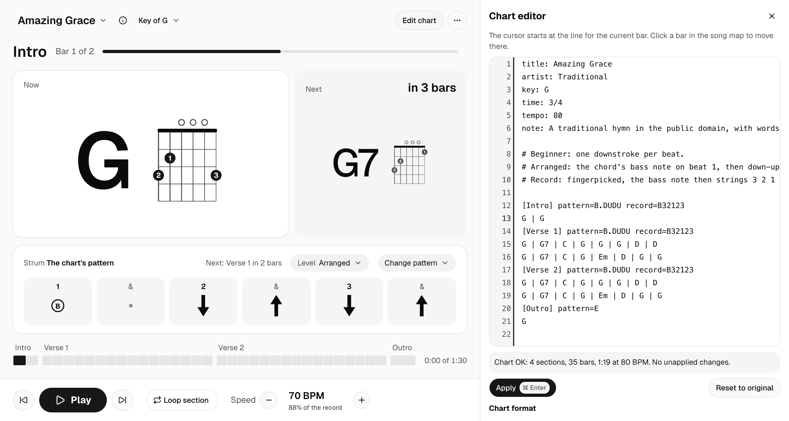

# Design system

How the app looks and behaves today, and the rules that keep new screens consistent with it. The values come from `app/src/index.css` and the components in `app/src/ui/components`. The [decision notes](../decisions/) record how the system got here, and the history table at the end links them.

This doc changes in the same commit as the tokens or components it describes. A change to one of the rules needs a new decision note first.

## Principles

1. Each visual signal has one meaning. A black fill (emphasis) means "now" or "progress". Red means an error or a destructive action. Nothing else on screen has a fill color or a hue.
2. The chord to play now reads first. It's the largest thing on screen, and the next chord is smaller and sits on a quieter card. Play mode is read from about 1.5 m away.
3. The screen shows what the practice session needs. Each practice mode shows its own controls, and settings used now and then live in Practice settings.
4. Everything follows browser zoom. Sizes are in rem, stage type also follows its card's size, and the play screen fills the window.
5. Components use tokens only, with no raw hex values or one-off sizes.

## Color

The theme is monochrome: neutral greys with no hue, black for emphasis and red for errors ([0010](../decisions/0010-monochrome-theme-and-geist.md)). It has one light theme.

| Token | Value | Use |
|---|---|---|
| `--background` | `#FAFAFA` | The page |
| `--card`, `--popover` | `#FFFFFF` | Cards, menus and dialogs |
| `--secondary`, `--muted`, `--tint`, `--slot`, `--editor-gutter` | `#F5F5F5` | Quiet surfaces: the Next card, strum slots, the looped section, the mode switch, the editor's line numbers |
| `--accent` | `#F0F0F0` | Hovered and focused items in menus |
| `--border`, `--input` | `#E5E5E5` | Borders, and bars not yet played in the song map. Decoration only |
| `--foreground` | `#0A0A0A` | Text and strum arrows |
| `--muted-foreground` | `#525252` | Secondary text and labels |
| `--dim` | `#8C8C8C` | Faint graphics that carry meaning: missed-strum dots, bars already played |
| `--diagram-line` | `#737373` | Fret lines in chord diagrams |
| `--diagram-string` | `#525252` | Strings and open-string circles in chord diagrams |
| `--primary`, `--ring` | `#171717` | Primary buttons, switches and the focus outline |
| `--emphasis` | `#171717` | Now and progress: the lit beat, the current bar, progress bars, the Play button |
| `--emphasis-image` | `none` | A gradient laid over the emphasis fill. Empty today |
| `--emphasis-foreground`, `--primary-foreground` | `#FFFFFF` | Text and icons on black |
| `--destructive` | `#DC2626` | Errors and destructive actions, such as chart errors and Delete song |
| `--error-line` | `#FEE2E2` | The background of a chart line with an error |

Emphasis is applied with the `bg-emphasis` utility, which sets both the color and the image. Color or a gradient can come back by changing `--emphasis` and `--emphasis-image`, with no change to components.

### Contrast

`app/src/ui/tokens.test.ts` reads the token file and checks these rules on every `npm test` run ([0009](../decisions/0009-birch-light-theme-and-session-modes.md)).

| Rule | Pairs checked | Lowest today |
|---|---|---|
| Play-mode text: at least 7:1, or 4.5:1 for large text | `foreground` and `muted-foreground` on `background`, `card`, `slot` and `tint` | 7.2:1, `muted-foreground` on `tint` |
| Text on black: at least 7:1 | `emphasis-foreground` on `emphasis`, `primary-foreground` on `primary` | 17.9:1 |
| Graphics that carry meaning: at least 3:1 | `dim` on every surface; `emphasis`, both diagram colors and `ring` on `card` and `background` | 3.1:1, `dim` on `tint` |
| Other text: at least 4.5:1 | `destructive` on `card`, `foreground` on `error-line`, `muted-foreground` on `editor-gutter`, `foreground` on `secondary` | 4.8:1, `destructive` on `card` |

Borders reach 1.3:1 on a card. They separate areas and never carry meaning on their own.

## Type

The typeface is Geist Variable (SIL Open Font License), served from the app so it works offline. The chart editor and pattern codes use the system's monospace font. ♯ and ♭ are drawn as small SVGs that take the text's color and size.

Interface text uses Tailwind's rem scale (`text-sm`, `text-lg` and so on). Play mode has its own stage sizes. The chord sizes follow the card they sit in: `cqi` is a percentage of the card's width and `cqb` of its height. Between a rem floor and ceiling, the chord grows and shrinks with its card.

| Token | Size | Use |
|---|---|---|
| `text-stage-chord` | `clamp(3rem, min(1.5rem + 26cqi, 100cqb - 2.5rem), 11rem)` | The chord to play now |
| `text-stage-next` | `clamp(2.5rem, min(1rem + 20cqi, (100cqb - 2.5rem) * 0.7), 6.5rem)` | The next chord, at 0.7 of the height the Now chord gets |
| `text-stage-chord-column` | `clamp(2.5rem, min(1.5rem + 26cqi, 50cqb - 1.5rem), 11rem)` | The Now chord in a narrow card, with the diagram under it |
| `text-stage-section` | `1.75rem` | The section name in the position line |
| `text-stage-countdown` | `1.375rem` | "in 3 beats" on the Next card |
| `text-stage-slot` | `1.125rem` | Beat numbers in the strum slots |

## Spacing, radius and layout

| Token | Value | Use |
|---|---|---|
| `--radius` | `0.625rem` | The base radius. shadcn's radius scale (`rounded-sm` to `rounded-4xl`) is set as multiples of it |
| `radius-slot` | `0.875rem` | Strum slots |
| `spacing-slot`, `-sm`, `-lg` | `5.5rem`, `4.25rem`, `7rem` | Strum slot height in normal, short and roomy windows |
| `spacing-strum-symbol`, `-sm`, `-lg` | `2.75rem`, `2.25rem`, `3.5rem` | Strum arrow height in the same windows |
| `spacing-diagram-now`, `-next`, `-column` | `min(34cqi, 18rem, …)` and similar | Chord diagram width, which follows the card like the chord name |
| `spacing-stage`, `-stacked` | `12rem`, `24rem` | The chord cards' smallest height, side by side and stacked on a phone |
| `spacing-map` | `1.25rem` | Bar height in the song map |
| `spacing-editor` | `min(36rem, 94vw)` | Chart editor width |
| `container-app` | `112rem` | The widest the app gets on a large monitor |

The play screen fills the window, like a desktop app ([0011](../decisions/0011-play-screen-fits-the-window.md)). Its rows keep their sizes and the chord cards take the height that's left. The app shell's height (`h-dvh`) and the editor's width cap (`94vw`, so it fits a phone) are the only viewport units. Three window-height variants set the layout, in rem so zoom moves them too:

| Variant | Window height | What it does |
|---|---|---|
| `fit` | 22rem or more | The app fills the window, and Play is its last row. The middle scrolls when it can't all fit |
| `short` | 44rem or less | Smaller gaps, padding and strum slots, so the chords keep their room |
| `roomy` | 56rem or more | The large strum slots |

Below 22rem (400% zoom, or a phone held sideways) the whole page scrolls instead, so the Play bar can't cover the screen.

## Motion

| Token | Timing | Use |
|---|---|---|
| `animate-soon` | 0.5 s, ease-out | A ring pulses out from the Next card one beat before the chord changes, and from the "New pattern next bar" badge a bar before the pattern changes |

## Components

Shared components are shadcn/ui in the Luma style, built on React Aria Components and styled with Tailwind CSS v4 ([0001](../decisions/0001-design-system.md)). Their code is in `app/src/ui/components`: alert, alert dialog, badge, button, card, collapsible, dialog, dropdown menu, field, input, input group, kbd, label, popover, progress, select, separator, sheet, slider, sonner (toasts), switch, textarea, toggle, toggle group and tooltip.

The app's own variants live in the copied component files:

| Component | Variant | Use |
|---|---|---|
| Button | `play`, size `xl` | Play and Pause. The only button with the emphasis fill |
| Button | `outline` | Section skips, speed steps and the menu button |
| Button | `ghost` | Small icon buttons such as About this song, How to practise and Close the editor |
| Button | `destructive` | Delete song, deleting a custom pattern, confirming a chart reset, and the Line buttons that jump to a chart error |
| Toggle | `outline` | Edit chart, which opens and closes the editor |
| Toggle group | `segment` | The practice mode switch: Learn a section, Build speed, Play the song |
| Progress | default | Build speed's progress, in the emphasis fill |

An input group draws the focus outline around the whole group, icon included, instead of around the bare input inside it.

React Aria handles focus, keyboard and press behavior. Hover styles apply only to a mouse, and dragging a finger off a control cancels the press. Every control shows a 2 px outline in `--ring` when focused from the keyboard. Disabled buttons drop to 50% opacity.

## The play screen

The play screen has six rows, from top to bottom:

1. Header: the song's title, which opens the library, About this song, the practice mode switch, How to practise, Edit chart and the menu.
2. Position line: the section name, the bar within the section and a progress bar for the section. During the count-in it shows the count, with the current beat filled with emphasis. While playing, it shows the bar's cue when the chart has one.
3. Chord cards. The Now card is white and largest, with the chord name and its diagram. The Next card sits on `--tint` with no border, and counts down to the change.
4. Strum card: the pattern's name, what's coming next, Level and Change pattern. Below them is one slot per eighth note. Arrows strum down or up, a dot is a missed strum, B picks the bass note, and 1 to 6 pick a string. The slot being played is filled with emphasis.
5. Song map: one block per bar, grouped under section names. Bars already played are `--dim`, the current bar is emphasis, and a looped section's name sits on `--tint`.
6. Transport bar: the previous and next section buttons, Play, and speed in BPM with its share of the record.

The chart editor opens as a panel beside the play screen, so the chords stay in view while editing. Lines with an error get the `--error-line` background and a message in `--destructive`.

## The library page

The song's title in the header opens the library in place of the play screen ([0014](../decisions/0014-library-page.md)). It fills the window the same way: the top rows stay put and only the list scrolls.

1. Top row: the "Library" heading, the search field (an input group with a search icon and a `/` key hint) and Back to the current song.
2. Filters: the collection filter in the `segment` toggle group, the difficulty select, and the number of songs listed. With Your songs chosen, New song sits at the end of the row.
3. The list: a card with column labels (Song, Chords, Difficulty) and one row per song. A row has the title with the artist or "Study" under it in `--muted-foreground`, the chords drawn with `ChordName`, and the difficulty. The focused or hovered row is `--accent`, and keyboard focus draws the 2 px outline inside the row. The current song has a small dot in the emphasis fill.

Below the `sm` breakpoint the column labels hide, the chords move under the title, and the collection names shorten (Folk, Yours).

When nothing matches, the list says so and offers Clear filters. Your songs, when there are none yet, explains what goes there and offers New song.

## Changing the system

1. Look in `app/src/ui/components` before writing a new component. Add shadcn components with `npx shadcn@latest add <name>`, and put the app's variants in the copied file.
2. Use tokens for every color, size, radius and duration. A value that's missing becomes a new token in `app/src/index.css`.
3. Keep custom views (chord diagrams, the strum strip, the song map) on the same tokens. SVG reads the CSS variables through Tailwind classes such as `stroke-diagram-line`.
4. Don't add colors. Color comes back through `--emphasis` and `--emphasis-image`, after a decision note.
5. Run `npm test` for the contrast rules and `npm run test:e2e` for the layout checks at zoom levels from 100% to 400%.
6. Update this doc, and retake the screenshots when the play screen changes visibly.

## History

| Decision | What it set | Status |
|---|---|---|
| [0001](../decisions/0001-design-system.md) | shadcn/ui on React Aria with Tailwind CSS v4, tokens only, React Aria hooks for custom views | Component choices stand |
| [0007](../decisions/0007-luma-style-and-inter.md) | shadcn's Luma style and Inter | Superseded by 0009 |
| [0009](../decisions/0009-birch-light-theme-and-session-modes.md) | A light theme, the contrast rules, rem sizing and the practice modes | Contrast, sizing and modes stand |
| [0010](../decisions/0010-monochrome-theme-and-geist.md) | Monochrome colors, the emphasis tokens and Geist | Current |
| [0011](../decisions/0011-play-screen-fits-the-window.md) | The play screen fills the window, with window-height variants | Current |
| [0014](../decisions/0014-library-page.md) | The library page, opened from the song's title | Current |
